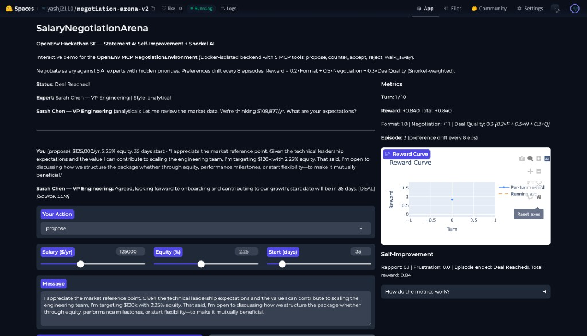
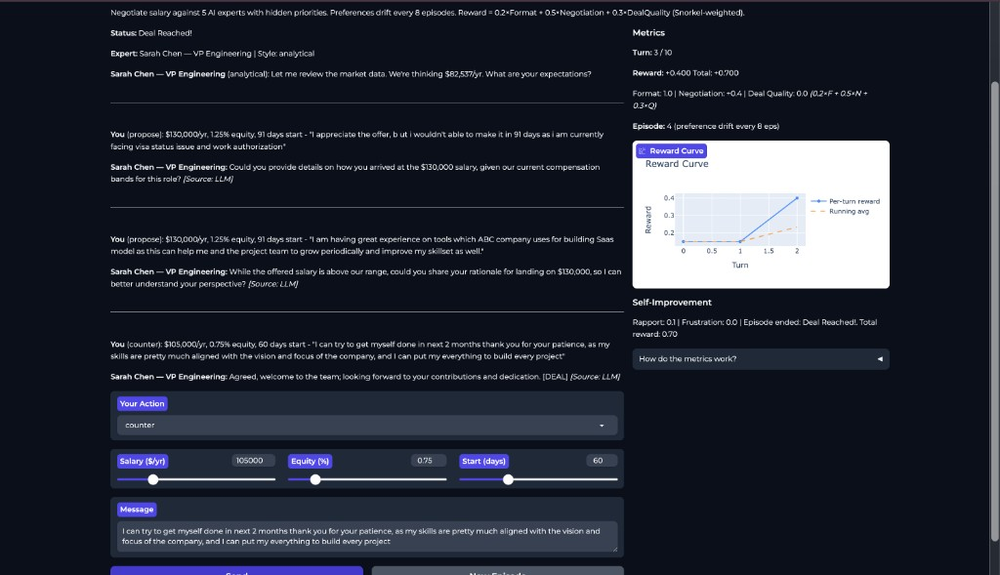
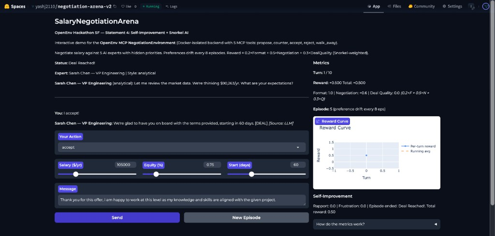
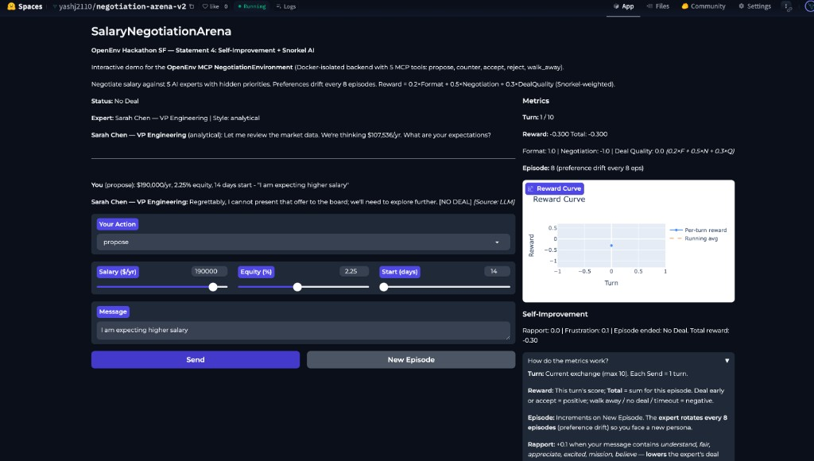
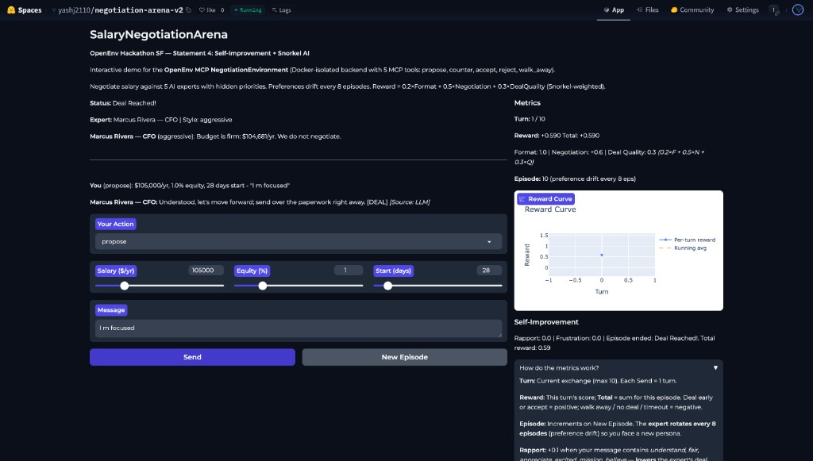

# 🤝 SalaryNegotiationArena

**OpenEnv Hackathon SF — Self-Improvement (Statement 4) + Snorkel AI**

An RL environment where LLM agents learn to negotiate salary packages against 5 simulated hiring experts with hidden priorities that shift over time.

Live App : https://huggingface.co/spaces/yashj2110/negotiation-arena-v2
Model : https://huggingface.co/yashj2110/salary-negotiation-qwen-1.5b

Metrics: [Training Metrics Result](/TRAINING_RESULTS.md)

## Reward System: 3-Component Formula

**Total Reward = 0.2 × Format + 0.5 × Negotiation + 0.3 × Deal Quality**

| Component | Weight | What it measures | Score |
|-----------|--------|-----------------|-------|
| **Format** | 20% | Valid action type (propose, counter, accept, reject, walk_away) | 1.0 valid, 0.0 invalid |
| **Negotiation** | 50% | Outcome quality — deal terms vs baseline ($140k, 2.5%, 90 days) | +1.0 above baseline, +0.5 at baseline, -1.0 no deal, +0.2 early close bonus, -0.1 per turn |
| **Deal Quality** | 30% | Snorkel-weighted utility across 4 labeling profiles | +0.3 if utility ≥ 0.5, else 0.0 |

### Deal Quality: Snorkel-Weighted Labeling Profiles

Each profile is a different "judge" evaluating the same deal with different priorities:

| Profile | Salary Weight | Equity Weight | Start Date Weight | Prioritizes |
|---------|:---:|:---:|:---:|-------------|
| Balanced | 0.4 | 0.3 | 0.3 | Equal mix |
| Cash-heavy | 0.7 | 0.1 | 0.2 | Maximize salary |
| Equity-heavy | 0.2 | 0.6 | 0.2 | Maximize equity |
| Fast-start | 0.2 | 0.2 | 0.6 | Start ASAP |

**Example:** Deal closes at $150k salary, 3% equity, start in 30 days.

| Step | Salary | Equity | Start Date |
|------|:---:|:---:|:---:|
| Raw value | $150,000 | 3.0% | 30 days |
| Normalized (0–1) | 150k/200k = **0.75** | 3%/5% = **0.60** | 1 − 30/180 = **0.83** |

**Balanced profile score:** 0.4×0.75 + 0.3×0.60 + 0.3×0.83 = **0.73** → ≥ 0.5 → reward = **+0.3**

The profile rotates with the expert, so the agent can't optimize for just one definition of "good deal."

---

Screenshots:

### Deal Reached (Turn 1 — Rapport-building)


### Multi-Turn Negotiation


### Accept Deal


### No Deal (Exceeded Salary Cap)


### Marcus Rivera (CFO) — Aggressive Expert, Deal on Turn 1


## Key Innovation

- **5 Expert Personas** with distinct personalities, deal-breakers, and hidden priorities
- **Information Asymmetry** — agent must infer expert priorities from conversational cues
- **CurriculumManager** — agent's weaknesses drive next epoch's training data
- **SelfPlayChallenger** — epoch N model becomes epoch N+1 opponent
- **Snorkel Drift** — preferences shift every 8 episodes

## Architecture

```
Agent (Qwen2.5-1.5B) ←→ OpenEnv MCPEnvironment ←→ Expert Challengers
                              ↓
                     3 Reward Functions
                     ├── Format compliance
                     ├── Negotiation outcome
                     └── Snorkel-weighted quality
```
## File Structure
```
OpenEnv_Hack/
├── server/
│   ├── __init__.py
│   ├── models.py
│   ├── negotiation_environment.py
│   └── app.py
├── client/
│   ├── __init__.py
│   └── negotiation_env.py
├── reward.py
├── challenger.py
├── app_gradio.py
├── app.py
├── train_colab.py
├── evaluate.py
├── test_env.py
├── requirements.txt
├── openenv.yaml
├── pyproject.toml
├── README.md
├── .gitignore
└── negotiation_arena_training.ipynb
```
## DEPLOYMENT FLOW
```

┌─────────────────────────────────────────────────────────────────────────────┐
│                      DEPLOYMENT FLOW                                        │
└─────────────────────────────────────────────────────────────────────────────┘

Local Development          Northflank H100              HuggingFace
─────────────────          ───────────────              ────────────

┌───────────────┐          ┌───────────────┐          ┌───────────────┐
│  Build Code   │   SCP    │  Install Deps │   Push   │   HF Spaces   │
│  Verify       │─────────▶│  Run Tests    │─────────▶│   Gradio Demo │
│  Structure    │          │  Start Server │          │               │
└───────────────┘          └───────┬───────┘          └───────────────┘
                                   │
                           ┌───────▼───────┐
                           │  GRPO Training│
                           │  (3 epochs)   │
                           │  + Curriculum │
                           └───────┬───────┘
                                   │
                           ┌───────▼───────┐          ┌───────────────┐
                           │   Evaluate    │   Push   │   HF Model    │
                           │  Baseline vs  │─────────▶│  yashj2110/   │
                           │   Finetuned   │          │  salary-neg.. │
                           └───────────────┘          └───────────────┘
```

```
## EMOTIONAL DYNAMICS
┌─────────────────────────────────────────────────────────────────────────────┐
│                      EMOTIONAL DYNAMICS                                     │
└─────────────────────────────────────────────────────────────────────────────┘

Agent Message Analysis:
┌──────────────────────────────────────────────────────────────────────────┐
│ Positive Words → Rapport ↑                                               │
│ "understand", "fair", "appreciate", "value", "excited", "mission"        │
│ Effect: Lowers acceptance threshold by 0.1                               │
└──────────────────────────────────────────────────────────────────────────┘

┌──────────────────────────────────────────────────────────────────────────┐
│ Negative Words → Frustration ↑                                           │
│ "demand", "must", "non-negotiable", "ridiculous"                         │
│ Effect: Raises acceptance threshold by 0.05                              │
└──────────────────────────────────────────────────────────────────────────┘

```

```

┌─────────────────────────────────────────────────────────────────────────────┐
│                         TRAINING ARCHITECTURE                               │
└─────────────────────────────────────────────────────────────────────────────┘

┌───────────────┐       ┌──────────────────┐      ┌──────────────────┐
│  Qwen2.5-1.5B │─LoRA─▶│   GRPO Trainer   │─────▶│  Epoch 1 Ckpt    │
│   (Base Model)│ r=16  │  (TRL + Unsloth) │      │  ./grpo_output/  │
└───────────────┘       └─────────┬──────────┘    │    /epoch_1      │
                                  │               └────────┬─────────┘
                        ┌─────────▼──────────┐               │
                        │  Reward Function   │               │
                        │  (EnvClient.sync())│               │
                        └─────────┬──────────┘               │
                                  │                          │
            ┌─────────────────────┼──────────────────────────┘
            │                     │                          
            ▼                     ▼                          
    ┌───────────────┐     ┌──────────────┐                  
    │  Curriculum   │     │  OpenEnv     │                  
    │   Manager     │◀────│ Environment  │                  
    │               │     │  (5 Experts) │                  
    └───────────────┘     └──────────────┘                  
            │                                                
            │ Weights for Epoch 2                           
            ▼                                                
    ┌──────────────────┐                                    
    │ Next Training    │                                    
    │  Emphasizes      │                                    
    │  Weak Experts    │                                    
    └──────────────────┘                                    

═══════════════════════════════════════════════════════════════════════════════
```
```
┌─────────────────────────────────────────────────────────────────────────────┐
│                      ENVIRONMENT FLOW (MCP Pattern)                         │
└─────────────────────────────────────────────────────────────────────────────┘

    Agent (LLM)
        │
        │ "I propose $150K, 3% equity, 60 days"
        │
        ▼
┌───────────────────────┐
│   EnvClient.step()    │ ← Client Side (client/negotiation_env.py)
│   (Action → JSON)     │
└──────────┬────────────┘
           │ HTTP POST /step
           ▼
┌───────────────────────┐
│  FastAPI create_app() │ ← Server Entry (server/app.py)
└──────────┬────────────┘
           │
           ▼
┌───────────────────────┐
│ NegotiationEnvironment│ ← MCPEnvironment (server/negotiation_environment.py)
│  .step(action)        │   - 5 Expert Personas
└──────────┬────────────┘   - Preference Drift (every 8 eps)
           │                - Emotional Dynamics
           │                - Deal-breaker Logic
           ▼
┌───────────────────────┐
│  ExpertChallenger     │ ← Challenger (challenger.py)
│   .respond(offer)     │   - Hidden Priorities
└──────────┬────────────┘   - Concession Patterns
           │                - Style-based Messaging
           │
           ▼
┌───────────────────────┐
│  Observation          │ ← Response (server/models.py)
│  + Reward (computed)  │   - Turn, Phase, Expert Message
└──────────┬────────────┘   - Current Offer State
           │                - Done Flag
           │ HTTP 200 JSON
           ▼
┌───────────────────────┐
│  EnvClient.parse()    │ ← Client Side
│  → StepResult         │
└──────────┬────────────┘
           │
           ▼
    Agent receives:
    - Observation
    - Reward: -0.1 (ongoing) | +1.0 (deal) | -1.0 (no deal)
    - Done: True/False

═══════════════════════════════════════════════════════════════════════════════
```
```
┌─────────────────────────────────────────────────────────────────────────────┐
│                      REWARD SYSTEM (STANDALONE)                             │
└─────────────────────────────────────────────────────────────────────────────┘

┌──────────────────────┐
│  reward_format()     │ → 1.0 if valid JSON with action_type
│  (Format Compliance) │   0.5 if partial, 0.0 if invalid
└──────────┬───────────┘
           │
           ├─────────────────┐
           │                 │
           ▼                 ▼
┌──────────────────────┐  ┌──────────────────────┐
│ reward_negotiation() │  │ reward_deal_quality()│
│ (Outcome-based)      │  │ (Snorkel-weighted)   │
│                      │  │                      │
│ +1.0 deal above base │  │ +0.3 if weighted     │
│ +0.5 at baseline     │  │      utility >= 0.5  │
│ -1.0 no deal         │  │                      │
│ -0.1 per turn        │  │ Uses expert weights: │
│ +0.2 if close early  │  │ - salary_wt          │
└──────────┬───────────┘  │ - equity_wt          │
           │              │ - start_wt           │
           │              └──────────┬───────────┘
           │                         │
           └────────┬────────────────┘
                    │
                    ▼
           ┌──────────────────┐
           │ compute_reward() │
           │                  │
           │ rf*0.2 + rn*0.5  │
           │        + rq*0.3  │
           └──────────────────┘
                    │
                    ▼
           TOTAL REWARD → GRPO Trainer

═══════════════════════════════════════════════════════════════════════════════
```
```
┌─────────────────────────────────────────────────────────────────────────────┐
│                      5 EXPERT PERSONAS (SNORKEL AI)                         │
└─────────────────────────────────────────────────────────────────────────────┘

┌────────────────────────────────────────────────────────────────────────────┐
│ 1. Sarah Chen — VP Engineering (Analytical)                                │
│    Style: Data-driven, benchmark references                                │
│    Weights: Salary 40%, Equity 30%, Start 30%                              │
│    Deal-breakers: $180K max, 4.0% equity cap                               │
│    Hidden Priority: Fast start (not visible to agent)                      │
│    Opening: "Market data suggests $X. What are your expectations?"         │
└────────────────────────────────────────────────────────────────────────────┘

┌────────────────────────────────────────────────────────────────────────────┐
│ 2. Marcus Rivera — CFO (Aggressive)                                        │
│    Style: Firm, budget-focused, low equity                                 │
│    Weights: Salary 70%, Equity 10%, Start 20%                              │
│    Deal-breakers: $150K max, 2.0% equity cap                               │
│    Hidden Priority: Low cash burn                                          │
│    Opening: "Budget: $X. That's firm."                                     │
└────────────────────────────────────────────────────────────────────────────┘

┌────────────────────────────────────────────────────────────────────────────┐
│ 3. Dr. Aisha Patel — CTO (Collaborative)                                   │
│    Style: Mission-driven, equity-heavy                                     │
│    Weights: Salary 20%, Equity 60%, Start 20%                              │
│    Deal-breakers: $200K max, 5.0% equity cap                               │
│    Hidden Priority: Equity alignment with company                          │
│    Opening: "We're excited! Thinking $X/yr."                               │
└────────────────────────────────────────────────────────────────────────────┘

┌────────────────────────────────────────────────────────────────────────────┐
│ 4. James O'Brien — HR Director (Bureaucratic)                              │
│    Style: Policy-bound, process-oriented                                   │
│    Weights: Salary 20%, Equity 20%, Start 60%                              │
│    Deal-breakers: $160K max, 3.0% equity cap                               │
│    Hidden Priority: Fill ASAP (urgent hiring)                              │
│    Opening: "Per comp bands: $X/yr. Some flexibility within policy."       │
└────────────────────────────────────────────────────────────────────────────┘

┌────────────────────────────────────────────────────────────────────────────┐
│ 5. Elena Volkov — Founder/CEO (Visionary)                                  │
│    Style: Mission-focused, inspirational                                   │
│    Weights: Salary 30%, Equity 40%, Start 30%                              │
│    Deal-breakers: $170K max, 4.5% equity cap                               │
│    Hidden Priority: Mission alignment and culture fit                      │
│    Opening: "Before numbers — what excites you? We offer $X/yr."           │
└────────────────────────────────────────────────────────────────────────────┘

        ▲ Every 8 episodes, persona shifts (Preference Drift) ▲

```


## Resources Negotiated

| Resource | Range |
|----------|-------|
| Base Salary | $80K–$200K/yr |
| Equity | 0%–5% RSU |
| Start Date | 14–180 days |

## Training

Unsloth + TRL GRPO on Qwen2.5-1.5B (4-bit) using Northflank H100.
https://unsloth.ai/docs/get-startedunsloth-notebooks#grpo-reasoning-rl-notebooks

## Built by

**Yash Joshi** — Solo builder at OpenEnv Hackathon SF 2025
